VPN的功能是：在公用网络上建立专用网络，进行加密通讯。在企业网络中有广泛应用。VPN网关通过对数据包的加密和数据包目标地址的转换实现远程访问。VPN有多种分类方式，主要是按协议进行分类。VPN可通过服务器、硬件、软件等多种方式实现。
<!-- Welcome to [Hexo](https://hexo.io/)! This is your very first post. Check [documentation](https://hexo.io/docs/) for more info. If you get any problems when using Hexo, you can find the answer in [troubleshooting](https://hexo.io/docs/troubleshooting.html) or you can ask me on [GitHub](https://github.com/hexojs/hexo/issues). -->

## 搭建环境参数

操作系统Windows

服务器IP：192.168.88.123  VPN：192.168.89.1 

客户端IP：192.168.78.3

客户端服务端单网卡，路由器做好端口映射

安装包附件下载 [openvpn-install-2.3.10](https://www.google.com/) 软件

### 安装客户端

打开安装包进行安装，客户端跟服务器安装方式一样，都需要安装

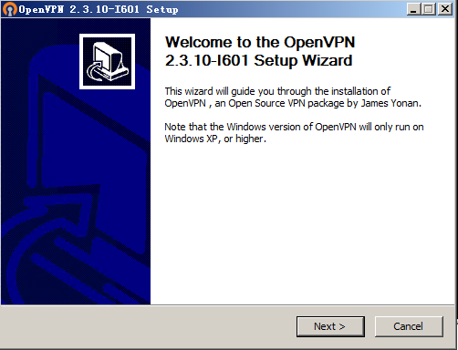

点击下一步

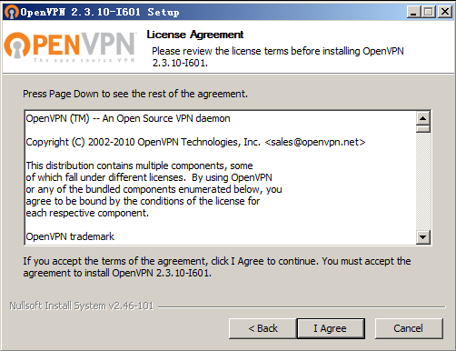

下面两个选项默认不勾选，我们需要勾选不然安装完无法命令行制作证书操作

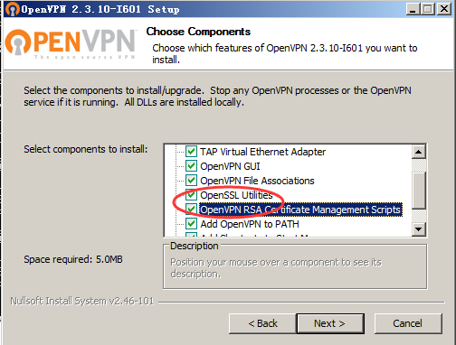

选择安装目录

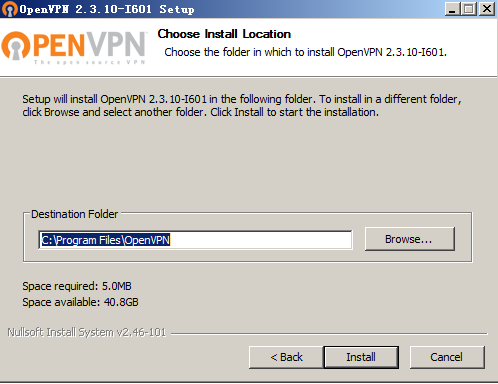

安装完成

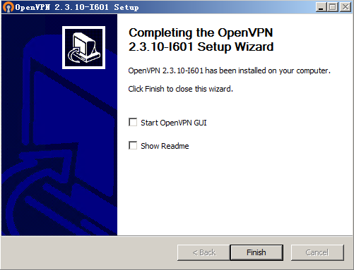

安装完成后系统会多出一张网卡TAP的 “本地连接2

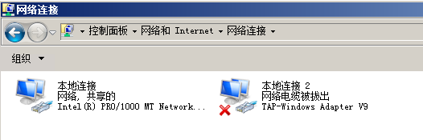

要想客户端能够通过服务端上网需要调整服务端本地网卡共享

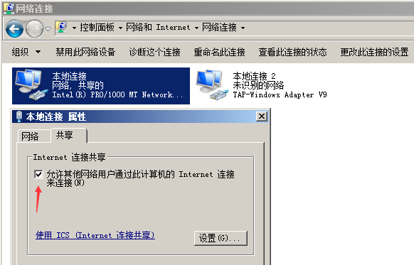

本地连接需要跟v9虚拟网卡做成桥接方可访问网络

### 服务端配置-生成相关证书配置

依次在openvpn/easy-rsa目录下执行以下命令
init-config

vars

clean-all

build-ca

build-dh.bat

build-key-server server   #生成服务端证书
这一步像 build-dh.bat 一样有些东西要填写，之后就是该回答 y 的 y 一下，关键就一个
Common Name 必须填，且必须唯一，否则会报错
failed to update database

TXT_DB error number 2

找不到 C:\Program Files\OpenVPN\easy-rsa\keys\*.old

要生成多个服务端的密钥和证书则继续 build-key-server server02

build-key client   #生成客户端证书
这一步像 build-dh.bat 一样有些东西要填写，之后就是该回答 y 的 y 一下，关键就一个
Common Name 必须填，且必须唯一，否则会报错
failed to update database

TXT_DB error number 2

找不到 C:\Program Files\OpenVPN\easy-rsa\keys\*.old

要生成其他的客户端密钥和证书，可以继续 build-key client02

..\bin\openvpn --genkey --secret keys\ta.key   # 生成 ta.key 文件

生成后文件夹下产生如下文件


### 服务端配置-生成相关证书配置

把配置文件server.ovpn放到C:\Program Files\OpenVPN\config目录下
把C:\Program Files\OpenVPN\easy-rsa\keys目录下的
ca.crt、ca.key、server01.crt、server01.csr、server01.key、dh1024.pem、ta.key 复制到
C:\Program Files\OpenVPN\config目录下。 
server.ovpn文件内容如下：
port 8080 #端口号

proto tcp #通讯协议

dev tun #内网连接协议

ca ca.crt #证书路径

cert server.crt #证书路径

key server.key #证书路径

;crl-verify vpncrl.pem

dh dh1024.pem #加密证书路径

server 192.168.89.0 255.255.255.0 #分配客户端地址池

ifconfig-pool-persist ipp.txt

push "redirect-gateway def1 bypass-dhcp" 

push "dhcp-option DNS 218.85.157.99" 

push "dhcp-option DNS 223.5.5.5" 

push "route 192.168.88.0 255.255.255.0"

client-to-client

;duplicate-cn

keepalive 10 120

tls-auth ta.key 0 # This file is secret

comp-lzo

;max-clients 100

user nobody

group nobody

persist-key

persist-tun

status openvpn-status.log

verb 4

配置文件如下

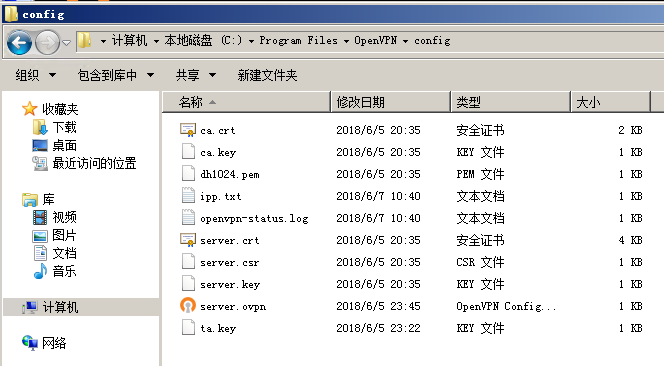

### 修改注册表

HKEY_LOCAL_MACHINE\SYSTEM\CurrentControlSet\Services\Tcpip\Parameters 将IPEnableRouter改为1
 
关闭防火墙或将8080端口加入到防火墙允许通过的端口中去

### 客户端配置

把配置文件client.ovpn放到客户端机器的C:\Program Files\OpenVPN\config目录下，并且把服务器C:\Program Files\OpenVPN\easy-rsa\keys目录下的
client01.crt、client01.csr、client01.key、ca.key、ca.crt、ta.key  文件一起复制到
客户端C:\Program Files\OpenVPN\config目录下 （以上文件为服务端生成，客户端需要在服务端拷贝这7个文件过来）
client.ovpn配置文件如下：
dev tun

proto tcp

remote 服务端IP 8080

resolv-retry infinite

nobind

user nobody

group nobody

persist-key

persist-tun

ca ca.crt

cert client.crt

key client.key

ns-cert-type server

tls-auth ta.key 1

comp-lzo

verb 4

配置文件如下

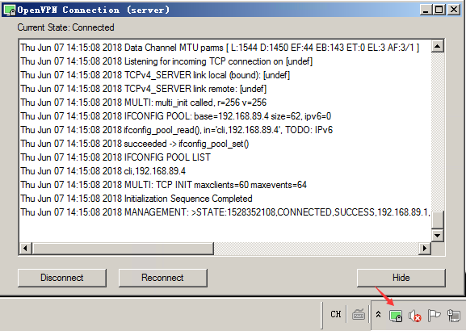

### 查看分配的ip及路由状态

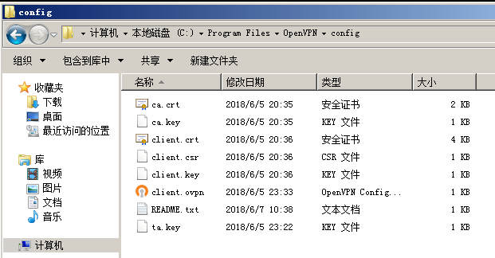

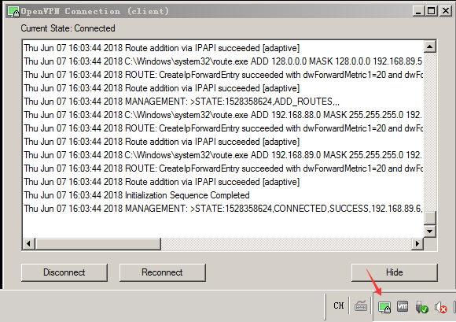

以上就是安装的全部流程。


<!-- ### Deploy to remote sites -->

<!-- ``` bash
$ hexo deploy
``` -->

<!-- More info: [Deployment](https://hexo.io/docs/deployment.html) -->
